# Bad Fellas

## Player

O jogador é um mosqueteiro que possuirá uma espada e uma capa.

- Começa com 10 pontos de vida.
- Ao perder todos os pontos de vida, reinicia o jogo desde o começo, restaurando a vida e o estado inicial das salas e inimigos.

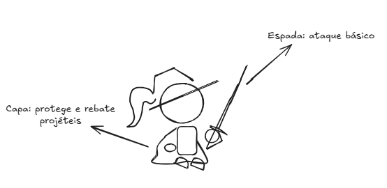

### Mecânicas principais

- Ataque normal com a espada;
- Proteger certos golpes com a capa;
- Perry (rebater) de projéteis com a capa - só é possível em uma pequena janela de tempo;
- Empurrar objetos;
- Utilizar itens. 

## Levels

### Level A

- **Sala I**

Sala principal da fase. Nela há uma porta trancada por uma chave e outras duas apenas fechadas. Ao derrotar todos os oponentes da sala, o jogador libera a *porta A*.

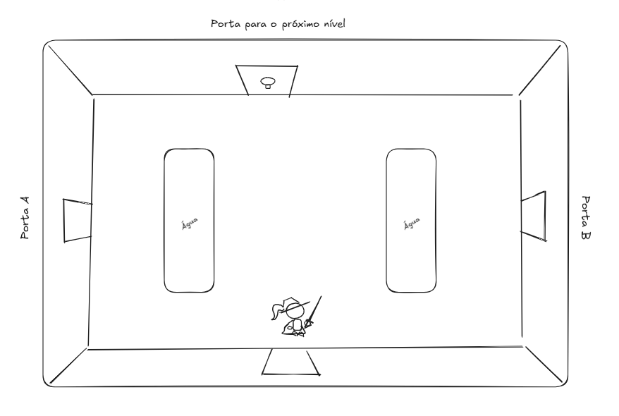

- **Sala II**

Sala do puzzle. Nela há um olho na parede inferior, outro na parede superior e 4 espelhos — 2 circulares e 2 retangulares. O objetivo é fazer com que o laser disparado pelo olho inferior atinja o olho superior, posicionando os espelhos no lugar certo para refletir o raio até o alvo. Os espelhos retangulares só podem ser movidos na horizontal, enquanto os circulares só se movem na vertical. O raio é disparado apenas quando o jogador aciona a alavanca posicionada no canto esquerdo da sala. Ao atingir o olho superior, a *porta B* é aberta.

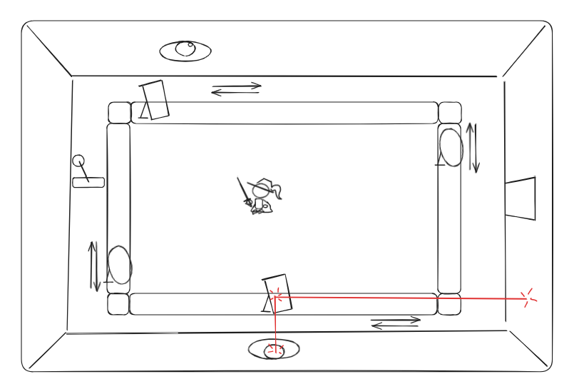

- **Sala III**

Sala da chave. O objetivo é o jogador chegar até o canto superior direito da sala, pegar a chave e retornar ao início. Inimigos já estarão na sala quando o jogador entrar e dificultarão a travessia. Com a chave em mãos, o jogador consegue abrir a porta trancada na sala principal.

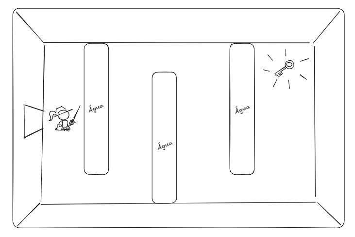

### Level B

- **Sala I**

Sala principal. Nela há um sapo, o Sapo Dorminhoco, que está dormindo na frente da saída para o próximo nível. O jogador precisa acordá-lo para poder avançar. A sala também tem uma porta à direita e outra à esquerda.

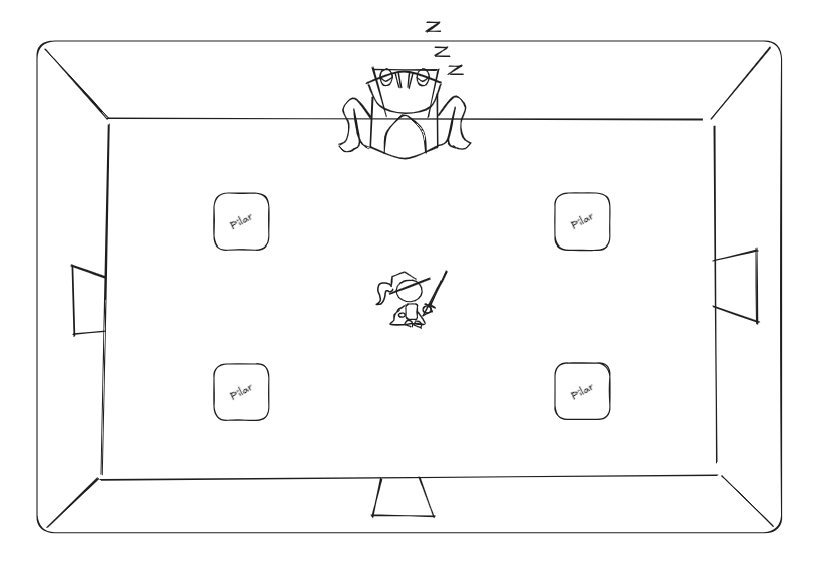

- **Sala II**

Sala do puzzle (acesso pela porta da direita). Nela há outro sapo, o Sapo Sabido, que diz que o jogador precisa tocar uma música para acordar o Sapo Dorminhoco. Se o jogador chegar a essa sala antes de conseguir a flauta, o Sapo Sabido pede que ele vá buscá-la para então poder ensinar a melodia.

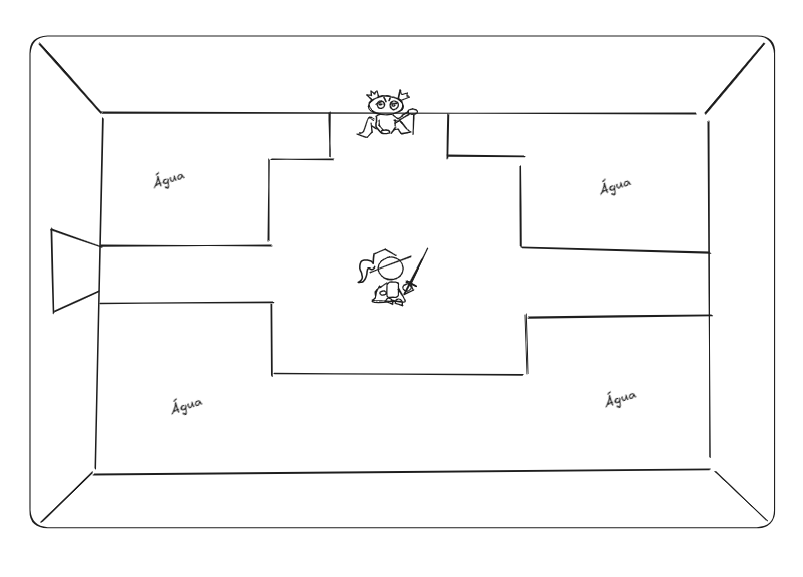

- **Sala III**

Sala de passagem (acesso pela porta da esquerda). Aqui há inimigos para desafiar o jogador. Não há muito o que fazer além disso — é apenas um obstáculo no caminho.

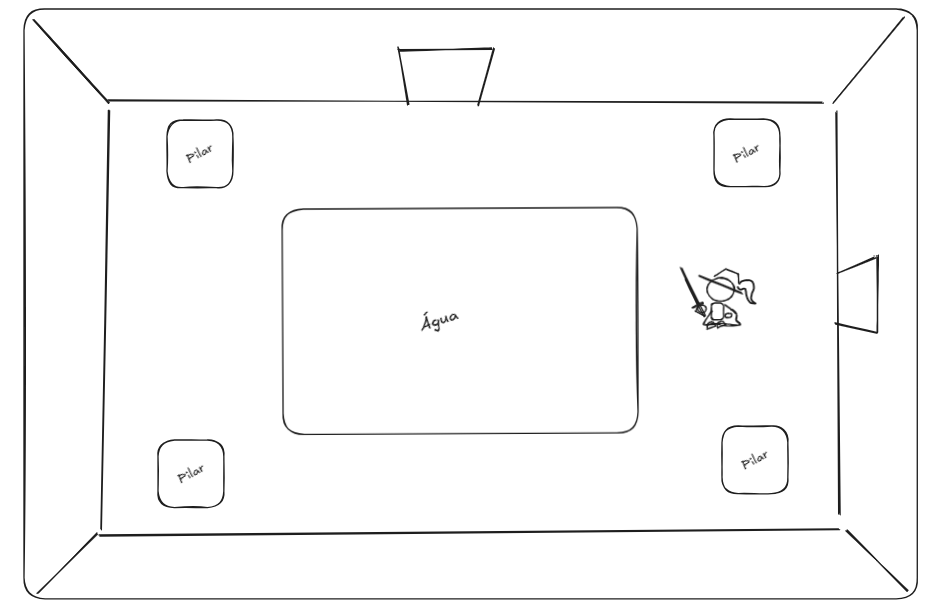

- **Sala IV**

Sala do miniboss. Nesta sala há um inimigo que usa uma flauta para invocar criaturas que atacam o jogador. Não é possível atacá-lo diretamente, pois um precipício o isola do resto da sala. Para derrotá-lo, o jogador precisa matar uma das criaturas invocadas, pegar a lança que ela solta e arremessá-la contra o inimigo. Após isso, o jogador poderá pegar a flauta.

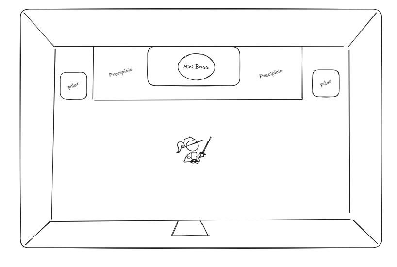

- **De volta à sala II**

Com a flauta em mãos, o Sapo Sabido inicia um puzzle: ele toca uma sequência de notas e o jogador precisa repeti-la. A cada rodada, o sapo repete a sequência anterior adicionando uma nova nota ao final. No total são 5 rodadas — a primeira com 3 notas, a segunda com 4, e assim por diante até a quinta, com 7 notas. A sequência é sempre aleatória, composta por no máximo 4 notas diferentes. Se o jogador errar, precisa recomeçar do zero.

Ao concluir o puzzle, o jogador aprende a melodia e pode voltar à sala principal para acordar o Sapo Dorminhoco, avançando assim para a próxima fase.

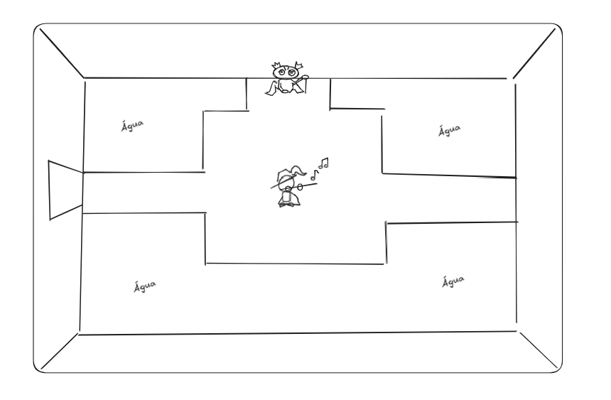

### Level C

- **Sala I**

Sala principal. Nela há um precipício separando o jogador da porta que leva ao próximo nível.

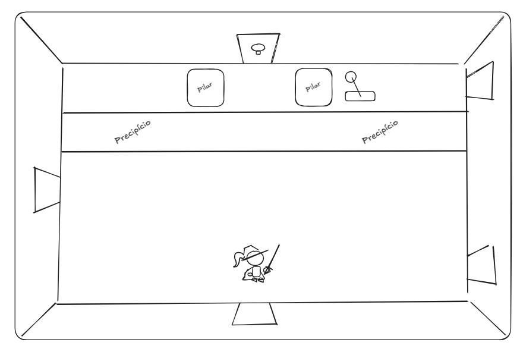

- **Sala II**

Caminho para a alavanca (acesso pela porta inferior direita). O jogador deve chegar até  o final da sala enquando esquiva das bolas de fogo lançadas.

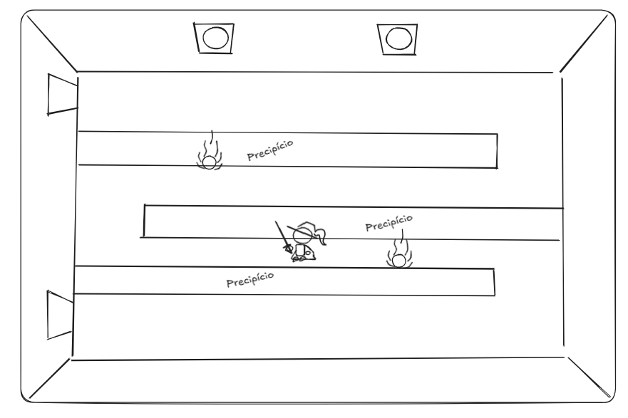

Ao chegar no final, o jogador encontra a porta que leva para a alvanca que ativa a ponte para a porta.

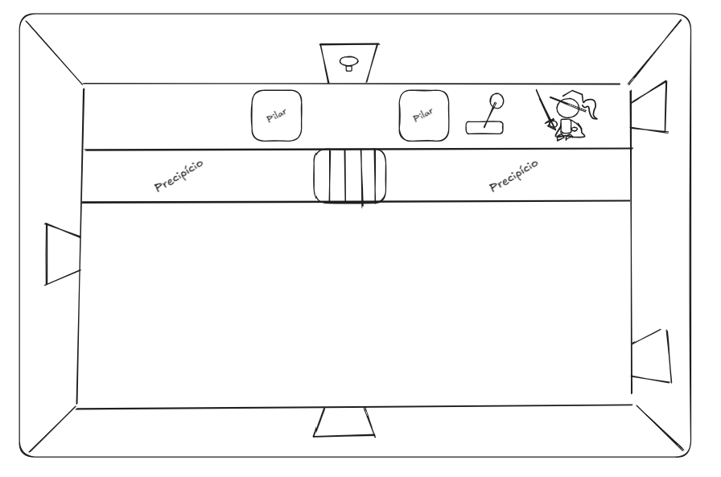

- **Sala III**

Sala de passagem (acesso pela porta esquerda). Não há nada de mais nessa sala, apenas inimigos para para dificultar a travessia do jogador.

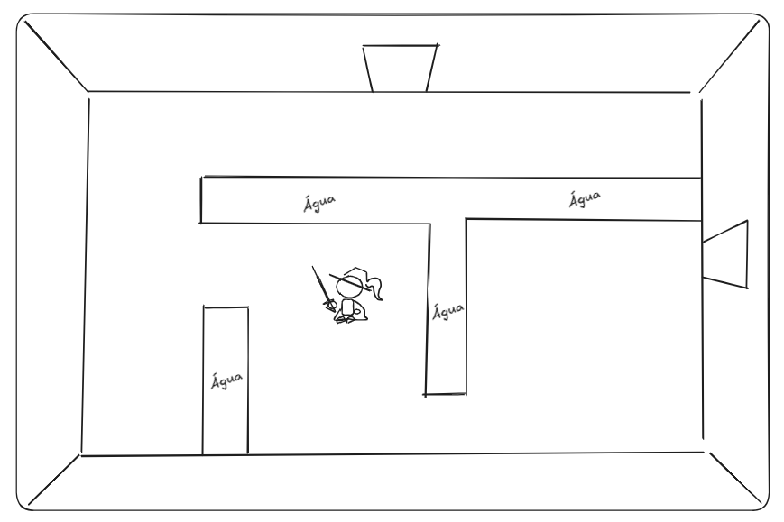

- **Sala IV**

Sala do puzzle. Nela encontra-se a estátua do Rei de Copas. Ele fará três charadas ao jogador. Caso o jogador selecione a resposta errada para alguma pergunta, a estátua atacará o jogador ou invocará inimigos. Após responder todas as três perguntas corretamente, a estátua entregará a chave que libera a porta da da sala principal.

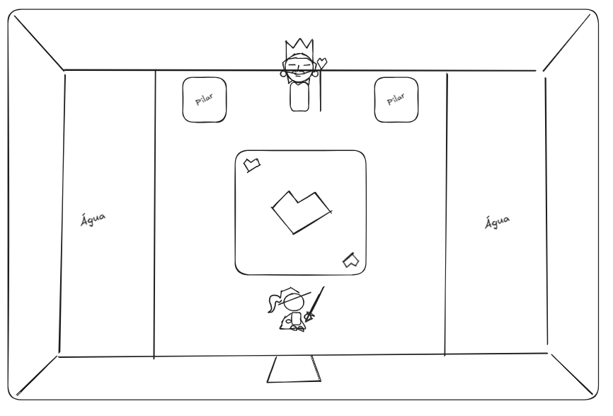
